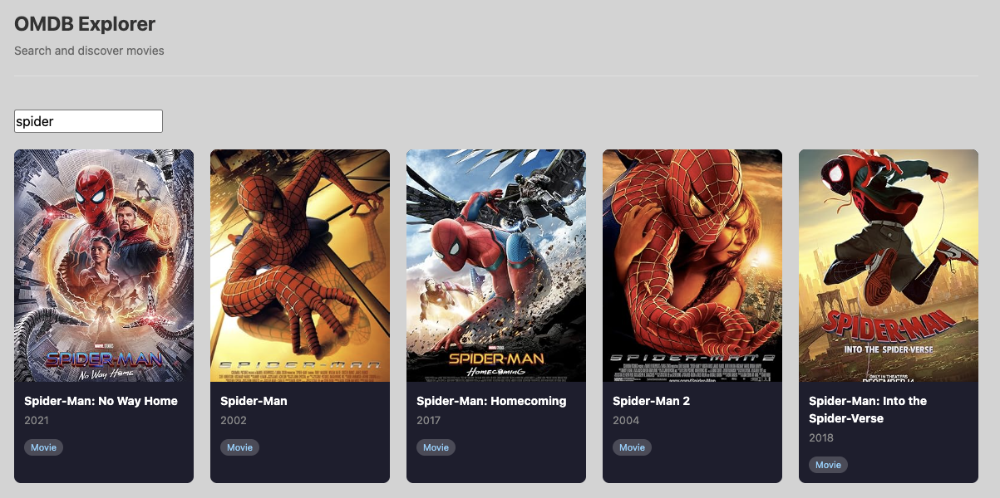
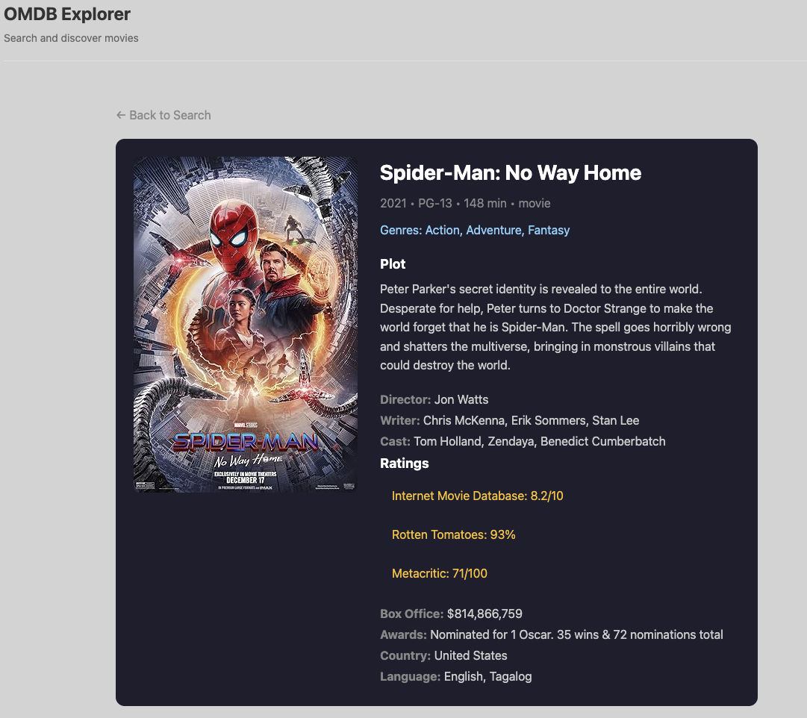

# OMDB Explorer

Simple react app to search movies and see movie detail using OMDB API.

### Screenshots




## How to run

1. Install dependencies

```bash
yarn install
```

2. Create .env file
   Copy `.env.example` to `.env` and fill in your API key (api key from requirement):

```bash
cp .env.example .env
```

Edit `.env` file:

```
VITE_OMDB_API_KEY=your_api_key_here
```

3. Run dev server

```bash
yarn dev
```

3. Open http://localhost:5173

## How to test

Run unit test:

```bash
yarn test
```

## Features

- Search movies (min 3 chars)
- Infinite scroll
- Movie detail page
- Poster popup
- Unit testing for components

## Tech Stack

- React + Vite
- Redux Toolkit
- Axios
- Vitest
- Module CSS
